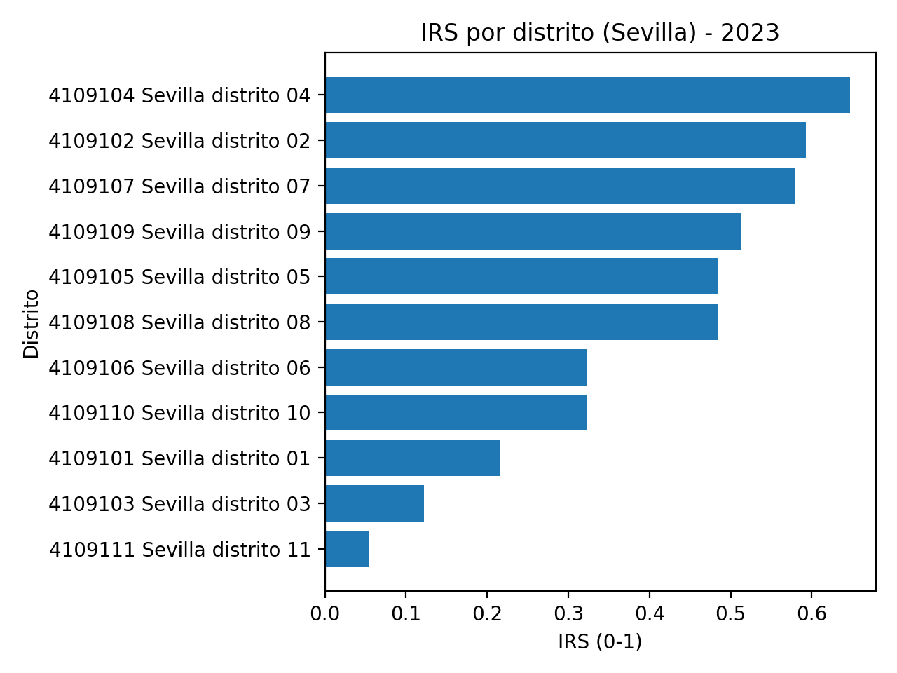
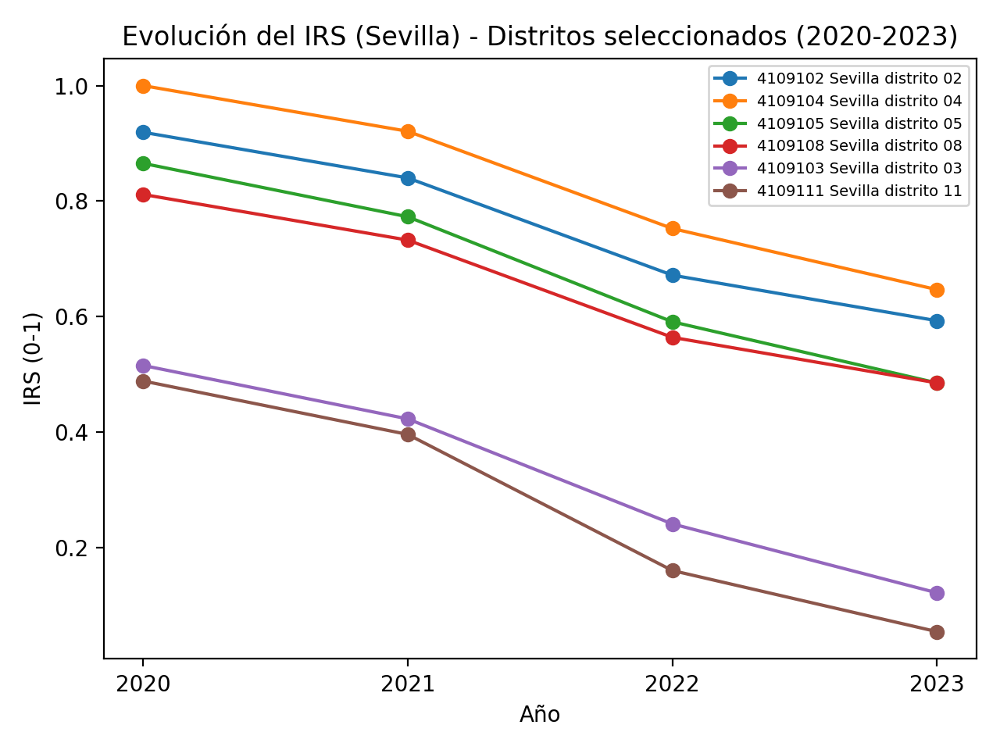
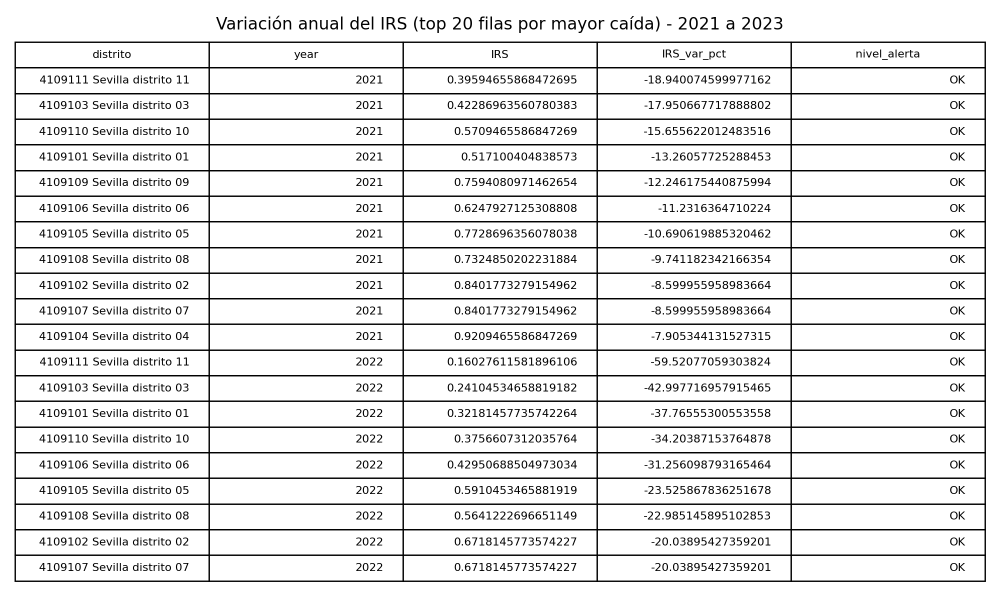
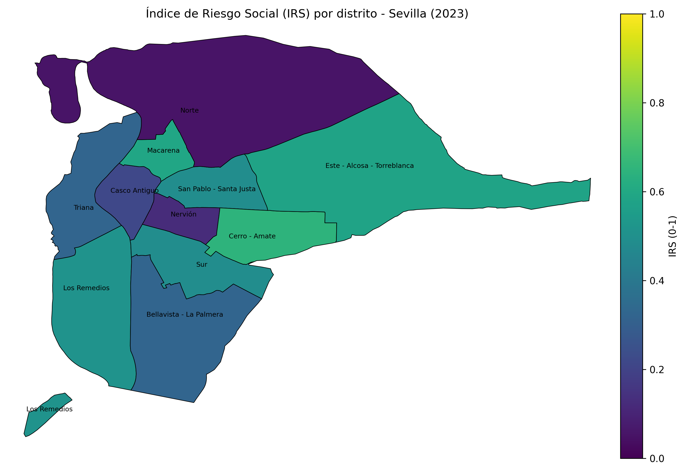

 DESIGUALDAD ZERO  
### Índice de Riesgo Social (IRS) y análisis territorial con datos públicos

**DESIGUALDAD ZERO** es un proyecto de analítica social aplicada que demuestra cómo es posible construir un **Índice de Riesgo Social (IRS)** a partir de datos públicos abiertos, con el objetivo de apoyar la toma de decisiones públicas a nivel territorial.

El proyecto utiliza datos reales de la ciudad de **Sevilla** y combina una perspectiva sociológica con técnicas de análisis de datos y visualización.

---

## 🧠 Objetivo del proyecto

- Integrar datos públicos heterogéneos (INE y SEPE).
- Construir un indicador sintético e interpretable de riesgo social.
- Analizar la evolución temporal del riesgo por distrito.
- Visualizar desigualdades territoriales mediante mapas y rankings.
- Explorar reglas simples de alerta temprana.

El proyecto se concibe como un **MVP analítico**, no como una plataforma final.

---

## 📊 Fuentes de datos

- **INE**: Mediana de la renta por unidad de consumo (nivel distrito).
- **SEPE**: Paro registrado (nivel municipal, agregado anual).

> ⚠️ Los datos originales no se incluyen en este repositorio.  
> Ver instrucciones en `data/README_data.md`.

---

## 🧮 Metodología (resumen)

- Normalización Min–Max de variables.
- Construcción de un índice sintético:
  
  \[
  IRS = 0.7 \cdot Riesgo\_Renta + 0.3 \cdot Paro\_Normalizado
  \]

- Cálculo de variaciones interanuales.
- Definición de alertas cuando el IRS aumenta más de un 20%.
- Visualización mediante rankings, series temporales y mapas coropléticos.

---
## 📊 Visualizaciones principales

### Ranking de riesgo social por distrito (2023)

### Evolución temporal del IRS (2020–2023)

### Variación anual del IRS

### Mapa coroplético del IRS – Sevilla (2023)

## 📈 Resultados principales

- Identificación de diferencias claras de riesgo social entre distritos.
- Tendencia general descendente del IRS en el periodo 2020–2023.
- Representación espacial clara del riesgo social a nivel intraurbano.

Las figuras generadas se encuentran en la carpeta `figures/`.

---

## 🛠️ Tecnologías utilizadas

- Python
- pandas
- numpy
- matplotlib
- GeoJSON

---

## 🔍 Contexto

Este proyecto fue desarrollado en el marco del  
**Máster Universitario en Analítica de Negocios Big Data**,  
como ejercicio aplicado de analítica de datos con impacto social.

---

## 🚀 Posibles extensiones

- Incorporar indicadores de vivienda o ayudas sociales.
- Aumentar la granularidad territorial.
- Implementar un dashboard interactivo para administraciones públicas.

---

## 👤 Autor

**Moisés**  
Perfil orientado a analítica de datos, impacto social y proyectos GovTech.
